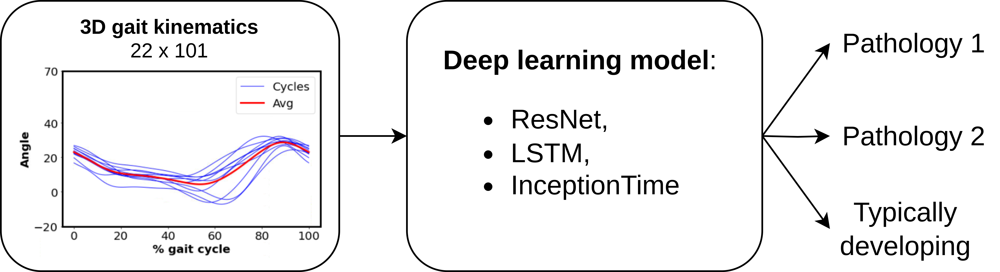

# A diagnostic tool for neurological gait disorders in childhood combining 3D gait kinematics and deep learning
A diagnostic tool for neurological gait disorders in childhood that combines 3D gait analysis and deep learning - Based on the work presented in this [paper](https://www.sciencedirect.com/science/article/pii/S0010482524001793) ([bibtex here for citation](https://github.com/LANZhengyang/Gait_DeepLearning_Diagnostic_Tool/blob/main/citation.bib)).



## Install

The implementation is base on Python 3.9.11. 

First clone the project
```
git clone https://github.com/LANZhengyang/Gait_DeepLearning_Diagnostic_Tool.git
cd Gait_DeepLearning_Diagnostic_Tool
```
The dependencies of this project can be installed by:

```
pip install -r requirements.txt
```

## How to use it

A demo can be found in the notebook [Demo.ipynb](https://github.com/LANZhengyang/Gait_DeepLearning_Diagnostic_Tool/blob/main/Training_with_lrR_ET-TDvsCP.ipynb). 
To train a different model, you can modify the Net_name (options: ResNet, LSTM, InceptionTime).
You can replace the input dataset to your own datasets too. To read different datasets, you can change the dir_dataset in the load_dataset_v1 function to specify the database location and the d_file_list to specify the dataset file for each class. 

In order to avoid overfitting caused by assigning cycles from the same patient to the training set, validation set and test set at the same time during the data splitting process, you also need to import the csv file by idx_file_list corresponding to each dataset. The second column of the csv file should be list of accumulated index of last cycle for patients. <br> For example:
| Patient name        | Accumulated index           |Total number of cycles  |
| ------------- |:-------------:| -----:|
| patient CPu 1      | 10 | 10 |
| patient CPu 2      | 34      |   24 |
| patient CPu 3 | 63      |    29 |
| patient CPu n | ...     |    ... |

## 
